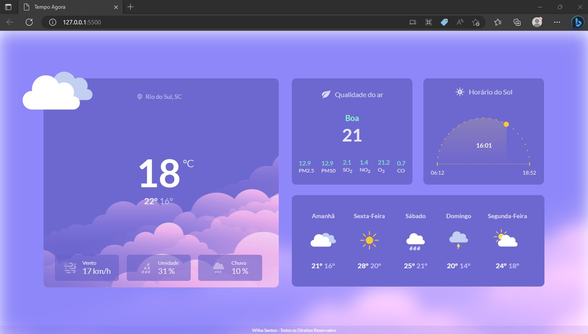

<h1 align="center">Página de Clima</h1>

O #boraCodar é um evento exclusivo e gratuito, promovido pela Rocketseat para ensino de tecnologias WEB. Onde toda semana é lançado um novo projeto, para te desafiar a evoluir suas técnicas. 

  <a href="#-tecnologias">Tecnologias</a>&nbsp;&nbsp;&nbsp;|&nbsp;&nbsp;&nbsp;
  <a href="#-projeto">Projeto</a>&nbsp;&nbsp;&nbsp;|&nbsp;&nbsp;&nbsp;
  <a href="#-layout">Layout</a>&nbsp;&nbsp;&nbsp;|&nbsp;&nbsp;&nbsp;
  <a href="#memo-licença">Licença</a>

  

 

  

 

## 🚀 Tecnologias

Esse projeto foi desenvolvido com as seguintes tecnologias:

- HTML e CSS
- Figma

 
## 💻 Projeto

Desenvolver o layout de uma página de clima, onde apresenta a temperatura do dia juntamente com a localização, o gráfico de horário do sol, qualidade do ar e a previsão da semana.

- [Visite o projeto]()

 
## 🔖 Layout

O layout do projeto encontra-se no Figma e você pode ter acesso através [DESSE LINK](https://www.figma.com/file/a1UgfSrOgHXMZRdSY8jPmp/%23boraCodar---Desafio-10-(Community)?node-id=328-2&t=ynPmJ3gZBXMReasj-0).

 
## 🔒 Layout

Esse projeto está sob a licença MIT.
